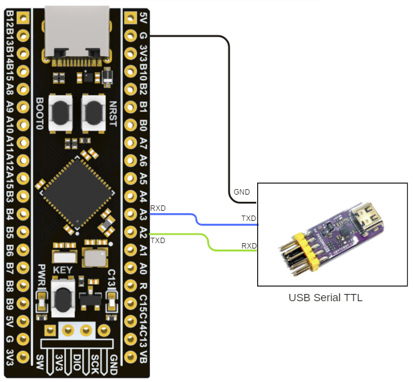
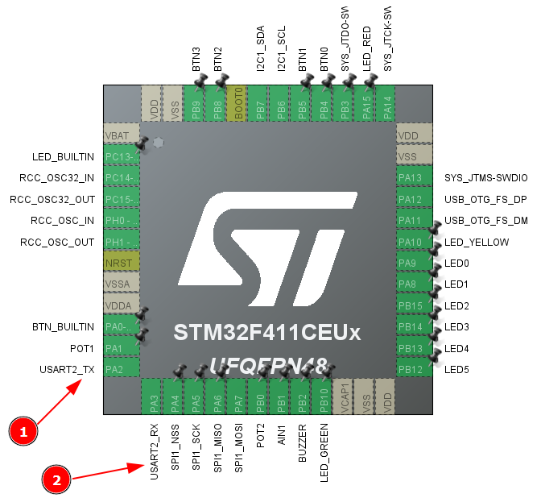

# Komunikasi UART2 STM32F411CEU6 dengan printf dan Toggle LED

Proyek ini menunjukkan cara mengirim data melalui UART2 menggunakan fungsi `printf` pada board STM32F411CEU6. Program ini akan mengirimkan pesan "Hello dunia" melalui UART2 dan melakukan toggle pada LED1 setiap 500ms.

## Fitur

- **Komunikasi UART (USART2)**: Mengirimkan pesan "Hello dunia" melalui UART2.
- **Toggle LED**: LED1 akan menyala dan mati bergantian setiap 500ms.
- **Implementasi printf**: Redirect output `printf` ke UART2 untuk memudahkan debugging atau komunikasi dengan serial monitor.

## Kebutuhan Hardware

- **Board STM32F411CEU6**
- **USB to UART atau alat sejenis** untuk menghubungkan ke output serial.
- **LED** yang terhubung ke pin GPIO jika Anda menggunakan LED eksternal.

## Koneksi Pin

Berikut adalah koneksi yang digunakan untuk komunikasi UART pada STM32F411CEU6:




- **PA2 (TX)**: Pin transmit UART2, terhubung ke RX dari modul FTDI (USB to UART).
- **PA3 (RX)**: Pin receive UART2, terhubung ke TX dari modul FTDI (USB to UART).
- **LED1**: Terhubung ke pin GPIO sesuai dengan yang didefinisikan dalam proyek Anda.

## Konfigurasi pin

Pastikan konfigurasi PA2 dan PA3 sebagai serial seperti gambar ini



## Pengaturan Software

Software menginisialisasi UART2 dengan parameter berikut:

- **Baud Rate**: 115200
- **Panjang Data**: 8 Bit
- **Stop Bit**: 1 Stop Bit
- **Parity**: None
- **Mode**: TX dan RX
- **Hardware Flow Control**: None
- **Oversampling**: 16

Implementasi ini juga mengonfigurasi `printf` agar mengirim data melalui UART2.

## Penjelasan Kode

### Inisialisasi UART

UART diinisialisasi di fungsi `MX_USART2_UART_Init()`. Berikut adalah konfigurasi yang digunakan:

```c
static void MX_USART2_UART_Init(void)
{
  huart2.Instance = USART2;
  huart2.Init.BaudRate = 115200;
  huart2.Init.WordLength = UART_WORDLENGTH_8B;
  huart2.Init.StopBits = UART_STOPBITS_1;
  huart2.Init.Parity = UART_PARITY_NONE;
  huart2.Init.Mode = UART_MODE_TX_RX;
  huart2.Init.HwFlowCtl = UART_HWCONTROL_NONE;
  huart2.Init.OverSampling = UART_OVERSAMPLING_16;
  if (HAL_UART_Init(&huart2) != HAL_OK)
  {
    Error_Handler();
  }
}
```

## Mengarahkan printf ke UART2

Agar fungsi printf dapat mengirimkan data melalui UART2, berikut prototipe dan implementasinya:

```c
#define PUTCHAR_PROTOTYPE int __io_putchar(int ch)

PUTCHAR_PROTOTYPE
{
  HAL_UART_Transmit(&huart2, (uint8_t *)&ch, 1, 0xFFFF);
  return ch;
}
```

Implementasi ini memastikan bahwa setiap data yang dikirim melalui printf akan ditransmisikan melalui UART2.

## Main Loop

Pada loop utama, program akan melakukan toggle pada LED1 dan mengirimkan pesan "Hello dunia" setiap 500 milidetik:

```c
while (1)
{
    HAL_GPIO_TogglePin(LED1_GPIO_Port, LED1_Pin);
    printf("Hello dunia\n\r");
    HAL_Delay(500);
}
```

## Cara Penggunaan

1. Hubungkan board STM32F411CEU6 ke komputer.
2. Flash program ini ke board.
3. Buka terminal serial (misalnya PuTTY, Tera Term, cutecom, picocom) dan atur baud rate ke 115200.
4. Amati pesan "Hello dunia" yang muncul setiap 500ms di terminal dan LED yang berkedip di board.

## Dependensi

1. Library HAL STM32
2. Kode yang dihasilkan STM32CubeMX
3. Terminal serial untuk melihat output UART
